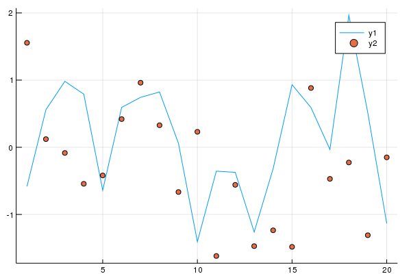

```julia;hide;
using Pkg
pkg"add Plots"
pkg"add Distributions"
pkg"add OnlineStats"
pkg"add CSV"
pkg"add AverageShiftedHistograms"
using InteractiveUtils
```

### Introduction to Julia

#### Dr. Josh Day

- GitHub: `@joshday`
- Email: emailjoshday@gmail.com

# Intro

## Resources

- [https://julialang.org](https://julialang.org)
- [https://juliaobserver.com/](https://juliaobserver.com/) (finding packages)
- [https://discourse.julialang.org](https://discourse.julialang.org) (ask for help)
- [http://julialang.slack.com/](http://julialang.slack.com/) (ask for help)
- [https://docs.julialang.org/en/](https://docs.julialang.org/en/) (documentation)

## Sapir-Worf Hypothesis
- **Your language influences how you think.**
- In programming, your language influences how you solve problems.

## Why do we need another language?

- R is great for statistics
- Matlab is great for computational linear algebra
- Python is great for a little bit of everything

### However...
- All three have slow for-loops
- The best R/Python libraries are written in C/Fortran
- Matlab is closed source
- R is down to 6 people with commit access to base R
- They were designed without modern technologies which are now being shoehorned in

**How do these languages influence how you solve problems when for loops are "bad"?**

### Wouldn't it be great if we had a language which...
- Was open source
- Had an active community (743 contributors to base Julia as of Sep 25, 2018)
- Was fast (avoids two language problem)
- Had clear syntax (Easy to read and write)

## What is Julia?
> Julia is a high-level, high-performance dynamic programming language for technical computing, with syntax that is familiar to users of other technical computing environments

### Aims to solve the "two language problem"
- Prototype code goes into high-level language like Python, production code goes into low-level language like C++

### Write high-level, abstract code that closely resembles mathematical formulas
- yet produces fast, low-level machine code that has traditionally only been generated by static languages.

### Julia is more than just "Fast R" or "Fast Matlab"
- Performance comes from features that work well together.  
- You can't just take the magic dust that makes Julia fast and sprinkle it on [language of choice]

## Julia Features

- Type system
- Multiple dispatch
- Type Inference
- Metaprogramming (macros)
- Just-in-time (JIT) compilation using LLVM
- Clean, familiar syntax

## Multiple Dispatch

- Multiple dispatch is the idea that a function calls a different *method* depending on the types of the arguments (more on this later).

```julia; repl;
f(x::Int) = 1
f(x::Float64) = 2
f(0)
f(0.0)
```

Julia packages are typically based around a grammar or interface of how to talk about some thing. 

Consider the [Distributions.jl](https://github.com/JuliaStats/Distributions.jl) package.  What is the grammar of how one talks about a probability distribution?

```julia; repl;
using Distributions
d1 = Normal(0.0, 1.0)
d2 = Beta(3.0, 5.0)
mean(d1)
mean(d2)
cdf(d1, 1)
cdf(d2, 1)
```

## Benchmarks, Time Relative to C


## Julia's Growth

- [https://pkg.julialang.org/pulse.html](https://pkg.julialang.org/pulse.html)


# Basics

### The REPL

Your first experience with Julia will probably be via the REPL (read-eval-print-loop)

```julia; repl;
x = 1

y = 2
```

There are several **REPL Modes** that can be activated by certain characters:

- `?` (help)
- `]` (package manager)
- `;` (shell)
- `$` (R via [RCall.jl](https://github.com/JuliaInterop/RCall.jl))

### Things have types

```julia; repl;
typeof(1)
typeof(1.0) 
typeof([1, 2])
```

### You can use unicode characters

Try typing `\alpha` or `\:+1:` and hit tab.

```julia;repl;
👍 = "thumbs up!"
```

### Code blocks use `end`

```julia
function f(x)
    x + 1
end
```

```julia
for i in 1:5
    println(i)
end
```

## Using Packages

```julia; repl;
using Distributions
g = Gamma(5, 1)
rand(g, 3)
mean(g), var(g), mode(g), pdf(g, 5)
```

### Packages are modules

```julia; repl;
module Thing
myfun(x) = "hello"
end;

Thing.myfun(1)
```


## How do I do X in Julia?

1. `?X`
2. Official docs
3. Discourse/Slack
4. Google

## How should I write code?

- Jupyter
    - For reproducibility (see also [Weave.jl](https://github.com/mpastell/Weave.jl) and [Literate.jl](https://github.com/fredrikekre/Literate.jl)), sharing code with others, and working with data on a server.
    - **NOT** your main work environment
- Atom and VS Code have good Julia plug-ins (I use VS Code)
- Julia Pro (Atom with the Juno plug-in preinstalled)

## Reading and Writing

- Delimited Files
  
```julia;repl
using DelimitedFiles
x = randn(10)
writedlm("temp.csv", x, ',')
y = readdlm("temp.csv")
```

- Delimited files -> read into a DataFrame
  
```julia;repl
using CSV
CSV.read("temp.csv", allowmissing = :none)
```

- (De)serialization

```julia;repl;
using Serialization
x = randn(10)
open(touch("temp"), "w") do io
    serialize(io, x)
end
y = open(deserialize, "temp", "r")
```


## Linear Algebra

- 1-based indexing

```julia;repl;
x = rand(3, 3)
x[1]
x[end-1]
x * rand(3)
rand(2, 2, 2)  # high-dimensional arrays
```

## Macros (functions of expressions)

Why does this need to be a macro?

```julia;repl;
@show x = 1
```

- **Super useful macros**
    - `@time` (time and allocations)
    - `@edit` (open up source code)
    - `@which` (find the method being called)
    - `@benchmark` (from [BenchmarkTools.jl](https://github.com/JuliaCI/BenchmarkTools.jl))

```julia;repl;
@time for i in 1:10
    sleep(.1)
end
```

# Type System

- **When thinking about types in Julia, think about sets.**
- Explore the type hierarchy with `supertype`, `subtypes`, `typeof`, `<:`

```julia; repl;
typeof(1)
supertype(Int)
subtypes(Number)
Int <: Number
```

# Multiple Dispatch

# Plotting

- No built in plotting package
- [Plots.jl](https://github.com/JuliaPlots/Plots.jl)
    - Interface around multiple plotting "backends"
- [Makie.jl](https://github.com/JuliaPlots/Makie.jl)

```julia;repl;
using Plots
p = plot(randn(20, 2), seriestype = [:line :scatter]);
png(p, "build/myplot.png")
```



# Using R or Python with Julia


# Gotchas

- Avoid global scope